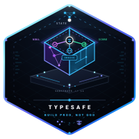

<p align="center">
  
</p>

<p align="center">
  <a href="https://hex.pm/packages/typesafe_sdk"></a>
  <a href="https://hexdocs.pm/typesafe_sdk"></a>
  <a href="https://github.com/nshkrdotcom/typesafe_sdk"></a>
  <a href="https://hex.pm/packages/typesafe_sdk"></a>
</p>

# TypeSafeSDK

**Machine intelligence that returns values your Elixir program can actually use.**

`typesafe_sdk` is the Elixir SDK for [TypeSafe AI](https://docs.typesafe.ai/introduction) and its first System One model, **Jev**.

TypeSafe evaluates structured state against typed questions and returns probabilistic answers directly:

```text
structured state
      +
typed questions
      │
      ▼
     Jev
      │
      ▼
typed probabilistic answers
```

In Elixir (after completing [Installation](#installation), run the examples in `iex -S mix`; later snippets reuse earlier bindings):

```elixir
alias TypeSafeSDK.{Choice, Noul, Score}

questions = %{
  billing: %Noul{
    instructions: "Is this customer contacting us about billing?"
  },

  department:
    Choice.new(
      %{
        "billing" => "Payments, invoices, refunds, and charges",
        "technical" => "Bugs, outages, or product failures",
        "account" => "Authentication or account management"
      },
      instructions: "Which team should handle this?"
    ),

  urgency:
    Score.new(
      ["Can wait", "Soon", "Today"],
      instructions: "How urgently does this need attention?"
    )
}

{:ok, result} =
  TypeSafeSDK.system_one(
    TypeSafeSDK.new_client(),
    %{
      "subject" => "Charged twice",
      "message" => "I see two charges for the same order. Please fix this today."
    },
    questions
  )

result.answers["billing"].noul
result.answers["department"].choice
result.answers["department"].probabilities
result.answers["urgency"].score
```

Responses return typed structs directly, without prompt engineering or JSON extraction layers.

---

## Why this is interesting

For most of machine learning's history, putting intelligence into software has meant choosing between two very different approaches.

### The classic classifier

Train a model for one known task:

```text
                 training data
                      │
                      ▼
text ──────► classifier ──────► label
```

Spam detection, sentiment, support-queue routing, or fraud classification.

For a fixed task, evaluate a classifier against your accuracy, latency, and operating-cost requirements.

But every new semantic question tends to become another modeling project:

```text
collect labels
    ↓
define taxonomy
    ↓
train / fine-tune
    ↓
evaluate
    ↓
calibrate
    ↓
deploy model
    ↓
version model
    ↓
repeat for the next question
```

### Then BERT changed the economics

[BERT](https://aclanthology.org/N19-1423/) made pretrained language representations reusable across downstream tasks.

Pretrained encoders made it possible to attach task-specific output heads to shared representations:

```text
                     fine-tuning
                         │
                         ▼
text ──────► pretrained encoder ──────► task head ──────► label
```

That was a major advance.

But the **task itself was still generally fixed at training time**.

A classifier fine-tuned to identify fraud does not suddenly become a calibrated urgency model because your application supplied:

```text
"How urgent is this issue?"
```

And a three-class classifier does not ordinarily become a 37-way business-specific router because the label set changed at runtime.

The representation became reusable; a fine-tuned classification head still defined the deployed output labels.

---

## Then LLMs made the task dynamic

Generative LLMs changed that.

Now the application could supply the task itself:

```text
state
 +
instructions
     │
     ▼
    LLM
     │
     ▼
 arbitrary generated text
```

One sufficiently capable model could classify, judge, extract, route, score, compare, and reason about questions that had never been defined when the model was trained.

That is an extraordinary capability.

But the interface is still fundamentally a **text generator**.

Software frequently has to turn:

```text
"I believe this customer should probably be routed to billing..."
```

back into:

```elixir
:billing
```

Structured-output and JSON-schema systems improve this enormously, but conceptually the underlying model is still performing autoregressive generation and software is constraining the resulting string into a machine-usable shape.

That makes perfect sense when you want the model to **write something**.

It is less obviously ideal when all your program needed was:

```elixir
true
```

or:

```elixir
:billing
```

or:

```elixir
%{
  level: 2.31,
  confidence: 0.94
}
```

---

# System One models take the other branch

TypeSafe's thesis is that there is another useful category of machine intelligence:

> **Models designed to evaluate structured decisions directly inside application software.**

Jev is TypeSafe's first public **System One Model**.

TypeSafe describes its [System One approach](https://docs.typesafe.ai/concepts/system-one) and [training approach](https://docs.typesafe.ai/introduction/machine-learning-primer) as using:

* a model designed for structured decisions,
* [parallel evaluation of independent questions](https://docs.typesafe.ai/concepts/how-to-build-with-system-one),
* **Reinforcement Learning for Calibrated Decisions (RLCD)**,
* typed outputs,
* probabilities for all three primitives, with separate confidence fields on Choice and Score answers.

Traditional token-generation workflow:

```text
state
  │
  ▼
generate token
  │
  ▼
generate token
  │
  ▼
generate token
  │
  ▼
parse resulting string
```

the conceptual interface is:

```text
                         ┌──► Noul  ───► probability
                         │
state + questions ──► Jev├──► Choice ──► distribution + confidence
                         │
                         └──► Score ───► score + distribution + confidence
```

The questions and output domains are supplied **at runtime**.

One call can ask multiple independent semantic questions.

The result is already shaped for software.

That is the primitive `typesafe_sdk` brings to Elixir.

---

# Why not just fine-tune BERT?

Sometimes you absolutely should.

If you have:

* one stable classification task,
* a large representative labeled dataset,
* a fixed label space,
* known deployment conditions,
* the ML infrastructure to train and operate the model,
* and no need to redefine its semantics dynamically,

a fine-tuned encoder can be an excellent engineering solution.

Task-specific classifiers remain well-suited for fixed taxonomies. System One applies when question criteria and label sets are defined dynamically by the application per request.

Consider a system that needs all of these:

```text
Is this request fraudulent?

Which of these 17 internal workflows applies?

How urgent is the situation?

Does this message contradict the account history?

Is the customer actually requesting cancellation?

Which of these dynamically supplied candidates best matches this record?
```

With conventional fine-tuning, those can become several datasets, heads, models, calibration exercises, deployments, and maintenance surfaces.

With System One, the application expresses them as questions.

```elixir
workflows = %{"refund" => "Return a payment", "support" => "Resolve a product issue"}

%{
  fraud: %Noul{instructions: "Is this request likely fraudulent?"},

  workflow:
    Choice.new(workflows,
      instructions: "Which workflow best matches the current state?"
    ),

  urgency:
    Score.new(
      ["Routine", "Important", "Urgent", "Immediate"],
      instructions: "How urgently should this be handled?"
    )
}
```

That is a fundamentally different developer experience.

In this programming model, it acts as a **general semantic decision primitive**.

---

# Is this actually new?

The ingredients have deep lineage.

None of these ideas appeared from nowhere:

```text
statistical classifiers
        │
        ▼
neural classifiers
        │
        ▼
pretrained encoders / BERT
        │
        ▼
instruction-following LLMs
        │
        ▼
function calling / JSON schema / structured outputs
```

Probability distributions, confidence calibration, discriminative classification, and typed schemas are established techniques.

What [TypeSafe calls a new model class](https://docs.typesafe.ai/concepts/system-one) is the **combination and optimization target**:

```text
general semantic understanding
        +
runtime-defined questions
        +
runtime-defined output domains
        +
typed answers by construction
        +
explicit probability / confidence
        +
parallel evaluation of independent questions
        +
training optimized for calibrated decisions
```

This suggests the following conceptual comparison; latency and cost depend on the implementation and workload:

```text
TASK-SPECIFIC CLASSIFIER                 GENERATIVE LLM

fixed question                           arbitrary question
fixed output head                        arbitrary strings
task-dependent latency                   task-dependent latency
easy to consume                          requires output control
requires task training                   no task-specific training

                    \                   /
                     \                 /
                      \               /
                       ▼             ▼

                         SYSTEM ONE

                     arbitrary questions
                      `bounded` answers
                    probabilistic outputs
                     software-native API
```

Whether “System One Model” becomes a durable new category is something the broader field will determine.

The practical distinction is the **programming model**: runtime questions with bounded, typed answers.

---

# Decomposing application logic and semantic judgment

Applications can separate deterministic logic from semantic judgment:

```text
                         ┌──────────────────────┐
                         │      application     │
                         │       state          │
                         └──────────┬───────────┘
                                    │
              ┌─────────────────────┴─────────────────────┐
              │                                           │
              ▼                                           ▼
     deterministic code                          semantic questions
     dates / arithmetic                          intent
     database facts                              ambiguity
     permissions                                 similarity
     exact comparisons                           urgency
     known invariants                            qualitative judgment
              │                                           │
              │                                           ▼
              │                                          Jev
              │                                           │
              └─────────────────────┬─────────────────────┘
                                    ▼
                              ordinary code
                                    │
                         branch / route / score
```

TypeSafe's [workflow guidance](https://docs.typesafe.ai/concepts/how-to-build-with-system-one) structures semantic questions as focused nodes within the application's broader compute graph, keeping supervision and state management in ordinary software.

---

# Why speed changes what you can build

TypeSafe describes System One as designed for [fast, structured decisions](https://docs.typesafe.ai/concepts/system-one), with [independent questions evaluated in parallel](https://docs.typesafe.ai/concepts/how-to-build-with-system-one). Benchmark end-to-end latency and cost against your own workload; this SDK does not guarantee a latency range.

But if the latency/cost profile holds for a use case, it changes where semantic inference can sit.

A multi-second generative call encourages:

```text
big request
    ↓
big model call
    ↓
big answer
```

Cheap, low-latency decisions encourage:

```text
question
question
question
question
question
question
    │
    ▼
ordinary program
```

That opens a different design space:

* high-frequency routing,
* semantic filtering,
* ranking,
* real-time UI decisions,
* event-stream enrichment,
* agent and workflow evaluation,
* large-scale document/data processing,
* uncertainty-aware automation,
* semantic feature generation,
* and decisions deep inside ordinary application code.

Alongside **intelligence per request**, consider **intelligence per second, per dollar, per branch in the program**.

---

# The three primitives

`typesafe_sdk` exposes the three question families currently provided by the live System One API.

## `Noul`

A probabilistic yes/no semantic predicate.

```elixir
%Noul{
  instructions: "Is this message requesting a refund?"
}
```

Conceptually:

```text
P(true | state, question)
```

Useful for:

* conditions,
* detection,
* semantic flags,
* gates,
* fuzzy predicates.

---

## `Choice`

Choose among an explicit set of alternatives.

```elixir
Choice.new(
  %{
    "billing" => "Payments, invoices, charges, or refunds",
    "technical" => "Product bugs, outages, or failures",
    "account" => "Authentication and account administration"
  },
  instructions: "Which department best matches this request?"
)
```

The response includes the selected choice and its probability distribution.

Useful for:

* routing,
* classification,
* candidate selection,
* intent resolution,
* policy categorization.

---

## `Score`

Evaluate something along an ordered scale.

```elixir
Score.new(
  [
    "Routine",
    "Important",
    "Urgent",
    "Immediate"
  ],
  instructions: "How urgent is this situation?"
)
```

Useful for:

* severity,
* priority,
* quality,
* relevance,
* confidence-like domain judgments,
* continuous decision thresholds.

The SDK requires a nonempty list of score criteria; the committed OpenAPI schema specifies `minItems: 1`. The [provenance guide](guides/upstream-provenance.md) records a stricter two-level server requirement, but that is not the SDK or schema rule.

### Question reference

This table describes the retained wire-oriented structs in `TypeSafeSDK`; their `instructions` field is optional and defaults to `nil`. Enforced keys require presence, not strict semantic validation. New code can use the `TypeSafeSDK.Question.*` constructors described below: Choice requires 2..255 options and Score requires 2..10 levels.

| Question | Enforced keys | Optional fields | Criteria |
| --- | --- | --- | --- |
| `Noul` | None | `instructions`, `criteria` | Map such as `%{"true" => "Unauthorized activity", "false" => "Legitimate activity"}`; descriptions are optional |
| `Choice` | `criteria` | `instructions` | Map of label to description or `nil`; a choice without a description is interpreted by its name alone |
| `Score` | `criteria` | `instructions` | Nonempty ordered list; position determines the level, starting at zero |

Descriptions and instructions can also contain JSON-compatible objects or arrays where the schema permits them. Raw question maps need a nonempty string `"type"`; choice and score maps also need `"criteria"`. Extra raw fields are preserved. At least one question is required.

### Answer reference

| Struct | Wire values and additive semantic fields |
| --- | --- |
| `TypeSafeSDK.NoulAnswer` | `noul`: numeric P(true), from 0 to 1. Also retains `id` and `raw`; there is no separate wire confidence |
| `TypeSafeSDK.ChoiceAnswer` | `choice`: selected label; `confidence`: certainty from 0 to 1; `probabilities`: map of labels to probabilities. Semantic calls restore caller option keys and add `id`, `raw`, and `option_order` |
| `TypeSafeSDK.ScoreAnswer` | `score`: probability-weighted expected level, possibly between integers; `confidence`: certainty from 0 to 1; `legend`: level descriptions; `probabilities`: level probabilities. Both maps use integer keys starting at 0. Also retains `id`, `raw`, `level`, `label`, `description`, `levels`, and `rubric` |

---

# Installation

Requires Elixir `~> 1.18`.

Add the dependency to your application's `mix.exs`:

```elixir
def deps do
  [
    {:typesafe_sdk, "~> 0.4.0"}
  ]
end
```

Then:

```bash
mix deps.get
```

Pristine `~> 0.4.0` is resolved automatically as the transport and runtime layer.

For the default TypeSafe service, get an API key from the [TypeSafe dashboard](https://console.typesafe.ai), following the [official quick start](https://docs.typesafe.ai/introduction/quickstart). For other TypeSafe-compatible providers, use the deployment URL, credential, and model ID issued for that provider.

Endpoint switching is a first-class client option:

```elixir
client =
  TypeSafeSDK.new_client(
    api_key: provider_key,
    base_url: "https://provider.example/deployments/my-typesafe-root",
    model: "provider-model-id"
  )
```

The base URL is the root **before** the `/v1/models` and `/v1/systemone` paths. Path prefixes are preserved.

For environment-driven host configuration:

```bash
export TYPESAFE_API_KEY='credential-issued-for-this-endpoint'
export TYPESAFE_BASE_URL='https://provider.example/deployments/my-typesafe-root'
export TYPESAFE_DEFAULT_MODEL='provider-model-id'
```

```elixir
# Your host application's config/runtime.exs
import Config

config :typesafe_sdk,
  api_key: System.fetch_env!("TYPESAFE_API_KEY"),
  base_url: System.get_env("TYPESAFE_BASE_URL", "https://api.typesafe.ai"),
  default_model: System.get_env("TYPESAFE_DEFAULT_MODEL", "jev-latest")
```

Configure `:typesafe_sdk` in your application's `config/runtime.exs`, or pass options explicitly to `TypeSafeSDK.new_client/1`.

The default transport is `Pristine.Adapters.Transport.Finch` with standard connection pooling; host applications do not need a custom Finch pool.

---

# Semantic Evaluation API

Define validated, typed questions and evaluate state to receive structured responses enriched with original Elixir keys, probability distributions, and provenance metadata:

```elixir
client = TypeSafeSDK.new_client()

questions = TypeSafeSDK.prepare!(
  urgent: TypeSafeSDK.noul("Does this need immediate attention?"),
  team: TypeSafeSDK.choice("Which team should handle this?",
    billing: "Invoices and payments", technical: "Failures and outages"),
  severity: TypeSafeSDK.score("Business impact?", [
    {"Low", "Cosmetic; a workaround exists"}, {"High", "Blocking core work"}
  ])
)

{:ok, response} = TypeSafeSDK.evaluate(client, "Our production integration is down", questions)

team = TypeSafeSDK.Response.fetch!(response, :team)
team.choice                                  # caller atom (:billing or :technical)
TypeSafeSDK.Answer.Choice.ranked(team)
TypeSafeSDK.Answer.Choice.margin(team)
TypeSafeSDK.Answer.Score.expected_level(response.answers.severity)
TypeSafeSDK.Answer.Score.max_level(response.answers.severity)
TypeSafeSDK.Answer.gate(team, act: 0.90, review: 0.70)
```

Strict evaluation validates answers against the exact questions sent (IDs, types, selected options, distribution sums, and Score bounds). Caller keys are restored through finite registries, never by dynamically atomizing strings.

Prepared sets cache validated question JSON. For multi-item evaluation, `evaluate_stream` and `evaluate_many` provide bounded supervised concurrency with explicit timeout budgets. For testing, `TypeSafeSDK.Test` allows deterministic mocking while preserving serialization and validation logic.

See [semantic questions](guides/semantic-questions.md), [answers](guides/answers-and-confidence.md), [batching](guides/batching.md), [testing](guides/testing.md), and [evaluating decisions](guides/evaluating-decisions.md).

---

# Runtime Controls & Contracts

TypeSafeSDK provides production controls for request budgets, response validation, and scoped cancellation. Transport execution, retries, and connection lifecycle are handled by Pristine:

```elixir
cancel = Pristine.Cancellation.new()

{:ok, response} =
  TypeSafeSDK.evaluate(client, state, prepared,
    cancellation: cancel,
    max_request_bytes: 262_144,
    response_contract: [
      on_unknown_answer: :error,
      allowed_models: ["jev-2026-09"]
    ]
  )

TypeSafeSDK.Response.metadata(response)
TypeSafeSDK.Prepared.fingerprint(prepared)
```

Inspect runtime cancellation capabilities:

```elixir
TypeSafeSDK.RuntimeCapabilities.report(client).runtime
# unary_cancellation: %{status: :supported | :unsupported | :unverified}
# cancellation_cleanup: %{status: :supported | :unsupported | :unverified}
```

Cancellation uses a `Pristine.Cancellation` token. When the underlying transport supports cancellation, the in-flight HTTP request is terminated and resources cleaned up.

Prepared values support composition via `keys/1`, `put/3`, `delete/2`, `take/2`, and `merge/2`. Each modified composition re-validates and re-computes a versioned `typesafe-prepared-v1:<sha256>` fingerprint covering the question contract.

See [runtime controls](guides/runtime-controls.md) for request budgets, response contracts, batch cancellation, and metadata options.

---

# OTP Integration & Telemetry

For process-oriented systems, TypeSafeSDK includes primary-value projections, privacy-safe per-answer telemetry, and an opt-in bounded OTP server facade:

```elixir
{:ok, response} = TypeSafeSDK.evaluate(client, state, prepared)

TypeSafeSDK.Response.values(response)
# => %{urgent: 0.91, team: :billing, severity: 1.7}
```

`[:typesafe_sdk, :answer]` telemetry events carry confidence, distribution shape, and structural correlation (`answer_type`, question ordinal, model/request ID, and Prepared fingerprint) without leaking state, question text, bodies, or credentials.

`TypeSafeSDK.OTP.Server` allows GenServer callbacks to run semantic workloads asynchronously without blocking the server process. The host application provides a `Task.Supervisor`, with `max_in_flight` bounding concurrent work.

See [bounded OTP integration](guides/otp-server.md) and [recursive decision patterns](guides/recursive-decisions.md).

---

# Low-Level Wire API (`system_one`)

```elixir
alias TypeSafeSDK.{Choice, Noul, Score}

client = TypeSafeSDK.new_client()

state = %{
  "customer_tier" => "enterprise",
  "subject" => "Charged twice",
  "message" => "I see two charges of $49 for the same order. Please fix this ASAP."
}

questions = %{
  billing: %Noul{
    instructions: "Is this issue about billing?"
  },

  department:
    Choice.new(
      %{
        "billing" => "Payments and invoices",
        "technical" => "Bugs and outages",
        "account" => "Account and authentication"
      },
      instructions: "Which team should handle this?"
    ),

  urgency:
    Score.new(
      ["Can wait", "Soon", "Today"],
      instructions: "How urgent is this?"
    )
}

{:ok, result} =
  TypeSafeSDK.system_one(
    client,
    state,
    questions
  )
```

Read the typed results:

```elixir
result.answers["billing"].noul
result.answers["department"].choice
result.answers["department"].probabilities
result.answers["department"].confidence
result.answers["urgency"].score

result.model
result.usage.input_tokens
result.request_id
```

### Response reference

| Struct | Fields |
| --- | --- |
| `TypeSafeSDK.SystemOneResponse` | `model`, `usage`, `answers`, `request_id`, `raw_http_response`, `raw`, `unknown_answers`, `retries`, `elapsed_ms`, `runtime_elapsed_ms`, `batch_index` |
| `TypeSafeSDK.Usage` | `input_tokens`, `output_tokens`; either can be `nil` |
| `TypeSafeSDK.ListModelsResponse` | `models`, `request_id`, `raw_http_response`, `raw`, `retries`, `elapsed_ms` |
| `TypeSafeSDK.ModelMetadata` | `name`, `description`, `release_date` (strings) |

`TypeSafeSDK.SystemOneResponse.nouls/1`, `choices/1`, and `scores/1` return maps filtered by answer type. Both response modules provide `request_id!/1` and `raw_http_response!/1`, which raise a configuration error if metadata is unavailable. The corresponding fields can be `nil`; a raw HTTP response is a `%Pristine.Response{}`. `TypeSafeSDK.Response` delegates these accessors and adds `fetch/2` and `fetch!/2`, which use exact caller keys. Semantic `elapsed_ms` includes local validation and decoding; `runtime_elapsed_ms` retains Pristine timing. Batch indexes are zero-based, and errors store their index in `details.batch_index`.

The official default service uses Bearer authentication at `https://api.typesafe.ai`.
For any selected TypeSafe-compatible base URL, `POST /v1/systemone` evaluates
questions and `GET /v1/models` lists models beneath that root (including any path
prefix). Use the selected provider's credential and model ID. A state may be a
string, object, or array.

The default model is:

```text
jev-latest
```

You can inspect currently available models:

```elixir
{:ok, available} = TypeSafeSDK.list_models(client)

Enum.map(available.models, & &1.name)
```

---

# One call, many judgments

A particularly important property of the API is that the application does not need to collapse a workflow into one giant prompt.

```elixir
questions = %{
  fraud: %Noul{
    instructions: "Does this interaction show evidence of fraud?"
  },

  intent:
    Choice.new(
      %{
        "refund" => nil,
        "cancel" => nil,
        "support" => nil,
        "purchase" => nil
      },
      instructions: "What is the customer's primary intent?"
    ),

  urgency:
    Score.new(
      ["Low", "Medium", "High", "Critical"],
      instructions: "How urgent is the situation?"
    )
}
```

Each result remains individually addressable; your program decides what those observations mean together. Call the API with the new questions before applying the policy:

```elixir
{:ok, result} = TypeSafeSDK.system_one(client, state, questions)

cond do
  result.answers["fraud"].noul >= 0.90 ->
    :manual_review

  result.answers["urgency"].score >= 2.5 ->
    :priority_queue

  result.answers["intent"].choice == "refund" ->
    :refund_workflow

  true ->
    :normal_queue
end
```

The intelligence supplies evidence; the application owns behavior.

---

# Probabilities are part of the API

A hard classification throws information away.

These are very different situations:

```text
billing = 0.51
billing = 0.99
```

even if both ultimately produce:

```text
billing = true
```

Answers expose probability distributions and confidence scores alongside predicted values.

That enables policies such as:

```elixir
confidence = result.answers["intent"].confidence

cond do
  confidence >= 0.98 ->
    :automate

  confidence >= 0.80 ->
    :light_review

  true ->
    :escalate
end
```

The thresholds are determined by your application policy. High model confidence reflects calibration, not guaranteed correctness.

For Noul, use its probability directly; only Choice and Score have a separate confidence field.

---

# Semantic and structural validity

There are two distinct failure classes:

```text
1. STRUCTURAL FAILURE

"I asked for one of three values and received malformed output."

2. SEMANTIC FAILURE

"The model returned a valid value, but it was the wrong judgment."
```

[TypeSafe describes System One](https://docs.typesafe.ai/concepts/system-one) as returning structured answers directly. The SDK validates received data and returns a response-validation error if payloads are malformed.

A schema-valid response may still contain an incorrect semantic judgment. The SDK exposes probability distributions and confidence metrics so applications can evaluate calibration and enforce their own decision thresholds.

---

# Raw and forward-compatible questions

Typed Elixir helpers cover the current `Noul`, `Choice`, and `Score` primitives.

Raw question maps are also accepted:

```elixir
%{
  custom: %{
    "type" => "future_question_type",
    "instructions" => "Evaluate this according to the new primitive",
    "future_field" => true
  }
}
```

This preserves unknown question types and additional fields so the SDK does not unnecessarily block compatible API evolution.

Unknown response answer types are skipped with a Logger warning rather than dynamically creating atoms or pretending they match known structures. Check that a named answer exists before accessing its fields when using future question types.

Score legend and probability keys are normalized to integer keys in Elixir.

---

# Configuration

Create a reusable client:

```elixir
client =
  TypeSafeSDK.new_client(
    api_key: System.fetch_env!("TYPESAFE_API_KEY"),
    timeout: 10,
    retry: [max_retries: 2]
  )
```

Per-call behavior can be overridden:

```elixir
TypeSafeSDK.list_models(
  client,
  timeout: 5,
  retry: false
)
```

Timeouts and retry backoff values use **seconds**.

`timeout_ms` is available when an explicit millisecond value is preferable.

### Client and application options

Host applications configure `:typesafe_sdk` in application config or pass options explicitly when creating a client.

| Client option | Application key under `:typesafe_sdk` | Default / units |
| --- | --- | --- |
| `:api_key` | `:api_key` | Required nonblank string |
| `:base_url` | `:base_url` | `"https://api.typesafe.ai"`; validated HTTP(S) root, path prefix retained, trailing slash removed |
| `:model` | `:default_model` | `"jev-latest"`; nonblank provider model ID |
| `:timeout` | None | Positive seconds; default request timeout is 10 seconds |
| `:timeout_ms` | `:timeout_ms` | `10_000` milliseconds; wins over `:timeout` |
| `:retry` | `:retry` | Default `TypeSafeSDK.RetryPolicy`; `false` disables retries |
| `:response_contract` | `:response_contract` | Compatibility-preserving contract defaults; semantic calls may override |
| `:max_request_bytes` | `:max_request_bytes` | `nil`; optional positive serialized request-byte limit |
| `:headers` | None | `%{}`; map or list of header pairs |
| `:transport` | `:transport` | `Pristine.Adapters.Transport.Finch` |
| `:transport_opts` | `:transport_opts` | `[]` |
| `:runtime_requirements` | None | `[]`; fail closed unless required Pristine transport capabilities are `:supported` |
| None | `:log_level` | `:warn` |

Use `:model` in client options and `:default_model` in application config. Explicit non-nil client values take precedence over config for key, URL, model, and retry. `base_url` accepts only nonblank `http`/`https` roots with a host; URL credentials, query strings, and fragments are rejected so selecting an endpoint cannot accidentally expose secrets or silently fall back. Path prefixes are retained when generated operation paths are appended. Transport options use an explicit value whenever present, including `nil`; omit them to use defaults.

### Per-call precedence

`TypeSafeSDK.system_one/4` accepts `:model`, `:timeout`, `:timeout_ms`, `:retry`, `:extra_headers`, and `:extra_body`. `TypeSafeSDK.list_models/2` accepts the timeout, retry, and extra-header options. Per-call non-nil timeout/retry values override the client; `:timeout_ms` wins over `:timeout`. A truthy per-call `:model` replaces the client default. A retry map or keyword list merges into the client policy: omitted fields inherit, explicit fields win, and `false` disables retries for that call.

`evaluate` / `evaluate!` accept those System One options plus `:probability_tolerance` (default 0.02, range 0..0.1), nested `:telemetry_metadata`, `:cancellation`, `:response_contract`, and `:max_request_bytes`. Their `extra_body` cannot replace `state`, `questions`, or `model`; question extras cannot replace `type`, `instructions`, or `criteria`. Strict header validation rejects malformed names/values and case-insensitive duplicates. Batch calls additionally accept `:max_concurrency`, `:max_pending`, `:ordered`, `:on_error`, `:task_timeout_ms`, and `:attempt_timeout_ms`; see [batching](guides/batching.md) for defaults, units and lifecycle contracts.

See [client configuration](guides/client-configuration.md) for more examples.

---

# Retry semantics

Retries provide at-least-once request execution, not exactly-once processing. A
transport failure after submission may occur after the service processed/billed
the evaluation. Local task cancellation cannot undo that remote work.

The SDK preserves the behavior of the upstream TypeSafe Python SDK.

By default it retries:

```text
connection failures
timeouts
HTTP 408
HTTP 429
HTTP 500..599
```

with:

```text
max retries        2 (up to 3 total attempts)
initial backoff    0.5 seconds, exponential
maximum backoff    5.0 seconds
jitter factor     0.25
total retry budget 30 seconds
```

`Retry-After` (seconds or HTTP date) and `retry-after-ms` are honored by default. `retry-after-ms` takes precedence when valid.

`TypeSafeSDK.RetryPolicy` fields are `max_retries`, `backoff_initial`, `backoff_max`, `backoff_jitter`, `http_statuses`, `respect_retry_after`, `api_connection_error`, `api_timeout_error`, and `timeout`. The three boolean flags default to `true`. The budget field `timeout` defaults to `30.0` seconds; `nil` disables that budget. The budget stops another retry when its delay would reach the budget, rather than interrupting an in-flight request.

`TypeSafeSDK.RetryPolicy.to_pristine_opts/1` maps `max_retries` to Pristine's `max_attempts`. Pristine 0.4.0 passes that value to its handler as a retry count, so the default is two retries after the initial request, without an off-by-one adjustment.

Per-call retry keyword/map values inherit omitted fields from the client policy; explicit fields win. An explicit `http_statuses` value replaces that field, and `retry: false` disables retries for the call.

HTTP execution, retry classification, and transport mechanics are handled by **Pristine 0.4.0**.

---

# Errors

```elixir
case TypeSafeSDK.system_one(client, state, questions) do
  {:ok, response} ->
    response

  {:error, %TypeSafeSDK.Error{} = error} ->
    %{
      type: error.type,
      status: error.status,
      message: error.message
    }
end
```

Successful responses retain:

```elixir
result.request_id
result.raw_http_response
```

Response-validation failures retain the same HTTP/request metadata when available.

### Error reference and raising behavior

`%TypeSafeSDK.Error{}` fields are `type`, `message`, `status`, `body`, `headers`, `request_id`, `retry_after_ms`, `field_path`, `path`, `endpoint`, `raw_http_response`, and `details`.

The `type` values include `:invalid_request`, `:task_exit`, `:runtime_capability`, `:configuration`, `:bad_request`, `:authentication`, `:permission_denied`, `:not_found`, `:unprocessable_entity`, `:rate_limit`, `:internal_server`, `:api_error`, `:connection`, `:timeout`, and `:response_validation`. HTTP 400/401/403/404/422/429 map to their dedicated types; statuses >= 500 map to `:internal_server`; other unsuccessful statuses map to `:api_error`.

HTTP 422 validation bodies contain a `detail` list whose entries have `loc`, `msg`, and `type`, optionally `input` and `ctx`. The SDK retains the body and formats field paths and messages into the error message, along with endpoint, status, and request ID when available.

The tuple convention applies to request results, not all invalid arguments:

- `TypeSafeSDK.new_client/1` raises a configuration error if no API key is available; invalid timeout/retry configuration can also raise.
- Legacy `system_one` question normalization failures return `{:error, %TypeSafeSDK.Error{type: :configuration}}`.
- On the legacy wire API, non-map, non-nil `extra_body` raises `ArgumentError`. Non-keyword option lists raise `ArgumentError` in `list_models`; `system_one` can instead raise `FunctionClauseError` while processing them. Non-list options can also fail operation guards.

Strict `Question.*.new`, `prepare`, and `evaluate` return local validation errors
with type `:invalid_request`, a component-list `path`, display `field_path`, and
structured `details`. Top-level `noul/choice/score`, `new!`, `prepare!`,
`evaluate!`, and `system_one!` raise on failure. Shared invalid batch options or
questions raise before enumeration even with `on_error: :collect`. Per-input
batch errors retain their input index; worker timeouts use `:timeout` with
`details.scope == :batch`, while worker exits use `:task_exit`.

`TypeSafeSDK.Error.retryable?(error, client.retry)` checks policy eligibility;
`retry_after(error)` returns milliseconds or nil. Neither promises remaining
attempts or exactly-once execution. See [retry ambiguity](guides/errors-and-retries.md).

This local validation example makes no HTTP request:

```elixir
validation_client = TypeSafeSDK.new_client(api_key: "local-validation-only")
{:error, %TypeSafeSDK.Error{type: :configuration, message: message}} =
  TypeSafeSDK.system_one(validation_client, "state", %{})
IO.puts(message)
```

See [errors and retries](guides/errors-and-retries.md).

---

# Request customization

The retained low-level `system_one/4` parity surface shallow-merges `extra_body` last, so legacy callers can intentionally replace `state`, `model`, or `questions`. The strict semantic `evaluate/4` surface does **not** allow those three protected fields to be overridden through `extra_body`; use the declared `state`, Prepared questions, and `model:` option instead.

`extra_headers` may add custom headers. Both it and client `headers` remove these protected names case-insensitively: `Authorization`, `Accept`, `Content-Type`, `User-Agent`, `X-TypeSafe-SDK`, `X-TypeSafe-Runtime`, and `X-TypeSafe-Retry-Count`. Extra body keys become strings; `nil` means no extra body.

`mix run examples/live_runtime_controls.exs` exercises both behaviors through the real API while `test/typesafe_sdk/runtime_test.exs` asserts the exact serialized body/header contract.

---

# Live examples

Live examples use the selected TypeSafe-compatible endpoint, not a fixed vendor URL. With no overrides, the SDK defaults remain `https://api.typesafe.ai` / `jev-latest`. To switch providers for the complete walkthrough:

```bash
export TYPESAFE_API_KEY='credential-issued-for-this-endpoint'
export TYPESAFE_BASE_URL='https://provider.example/deployment-root'
export TYPESAFE_DEFAULT_MODEL='provider-model-id'
bash examples/run_all.sh
```

Every advertised live script forces Pristine's real HTTP adapter, has no fixture/offline fallback, and prints the selected endpoint/model without printing the API key. Retries are disabled by default. The default runner has a bounded 63-request upper limit; conditional branches can use fewer calls.

```bash
mix run examples/live_evaluation.exs
mix run examples/live_semantic.exs
mix run examples/live_composition_contracts.exs
mix run examples/live_runtime_controls.exs
mix run examples/live_batching.exs
mix run examples/live_observability.exs
mix run examples/live_decision_patterns.exs
mix run examples/live_otp_server.exs
mix run examples/live_recursive_decisions.exs
```

The catalog maps all public 0.2-0.4 capabilities to runnable coverage and labels honest test-only exceptions such as `TypeSafeSDK.Test`, future unknown answer types, deterministic overload/race failures, codegen freshness, and architecture gates. The evaluation CLI and live recorder also accept explicit `--base-url` / `--model` overrides that win over environment defaults.

See the [complete live example catalog](examples/README.md) for endpoint compatibility requirements, exact request bounds, failure/cancellation semantics, and the feature matrix. The [evaluation workflow](examples/evaluation/README.md) documents dataset contracts and CLI precedence.

---

# Tests

The repository includes comprehensive offline test coverage spanning semantics, response structures, batch lifecycles, and OTP server operations.

Run the standard test suite:

```bash
mix test
```

Live tests against the TypeSafe API are explicit and opt-in:

```bash
TYPESAFE_API_KEY=your_key mix test --include live
```

---

# Code Generation & Repository Layout

The provider wire client is generated from the TypeSafe OpenAPI specification via PristineCodegen, while higher-level semantic interfaces and OTP tooling live in handwritten Elixir modules.

Generated code lives under `lib/typesafe_sdk/generated/` and is verified in CI.

### Repository Map

| Path | Purpose |
| --- | --- |
| `lib/typesafe_sdk.ex`, `lib/typesafe_sdk/*.ex` | Public API, semantic contracts, OTP server, telemetry |
| `lib/typesafe_sdk/generated/` | Generated API client modules |
| `codegen/` | Generator tooling (excluded from Hex package) |
| `priv/upstream/openapi.json` | Committed OpenAPI specification |
| `priv/generated/` | Generated contract manifests |
| `test/`, `guides/`, `examples/` | Test suites, documentation guides, executable examples |

For generator maintenance, upstream provenance, and contribution workflows, see [generation and verification](guides/generation-and-verification.md) and [upstream provenance](guides/upstream-provenance.md).

---

# Architecture

`typesafe_sdk` deliberately stays small.

```text
                         Your Elixir Application
                                  │
                                  ▼
                        ┌─────────────────────┐
                        │     TypeSafeSDK     │
                        │                     │
                        │ Client              │
                        │ Noul / Choice/Score │
                        │ response types      │
                        └──────────┬──────────┘
                                   │
                          generated operation
                                   │
                                   ▼
                        ┌─────────────────────┐
                        │      Pristine       │
                        │                     │
                        │ HTTP                │
                        │ retries             │
                        │ provider runtime    │
                        │ transport policy    │
                        └──────────┬──────────┘
                                   │
                                   ▼
                      ┌────────────────────────┐
                      │ TypeSafe System One API│
                      │          Jev           │
                      └────────────────────────┘
```

`typesafe_sdk` provides Elixir ergonomics and semantic validation, relying on Pristine for robust HTTP transport, retries, and execution policies.

---

# What this unlocks in Elixir

The BEAM is particularly comfortable with small, composable decisions.

A semantic call can participate naturally in:

```text
GenServer
GenStateMachine
Task
Task.Supervisor
DynamicSupervisor
Broadway
GenStage
Phoenix
Oban
ordinary functional pipelines
```

For example:

```elixir
routing_questions = %{
  fraud: %Noul{instructions: "Does this interaction show evidence of fraud?"},
  department: Choice.new(%{"billing" => "Payments and charges", "technical" => "Product issues"})
}

with {:ok, evaluation} <- TypeSafeSDK.system_one(client, state, routing_questions),
     false <- evaluation.answers["fraud"].noul >= 0.90,
     "billing" <- evaluation.answers["department"].choice do
  {:route_to_billing, state}
else
  true ->
    {:queue_for_review, state}

  _ ->
    {:route_elsewhere, state}
end
```

The SDK provides typed semantic operations that integrate into any standard OTP architecture; benchmark latency for your workload.

---

# The bigger idea

Deterministic code readily handles exact conditional checks:

```text
Is x > 5?

Did this row exist?

Does this token have permission?

Did the checksum match?
```

Qualitative semantic questions traditionally required heuristic rules, custom ML models, or unstructured generative prompts:

```text
Does this customer sound like they are actually trying to cancel?

Is this incident description materially different from the previous one?

Which of these policies best describes what is happening?

Does this explanation appear consistent with the evidence?

How urgent is this situation?
```

System One allows applications to express these questions as typed function calls with bounded outputs and calibrated probabilities. `typesafe_sdk` makes that primitive native to Elixir.

---

# Documentation

The [0.4.0 cheatsheet](cheatsheets/typesafe_sdk.cheatmd) covers strict constructors,
prepared evaluation, uncertainty helpers, batches, tests and contract tools. The
[labeled evaluation workflow](examples/evaluation/README.md) includes development
and held-out datasets, policy freezing, coverage/error metrics and latency/token reporting.

* [Guide index](guides/index.md) — installation, configuration, API usage, and maintenance.
* [Live example catalog](examples/README.md) — semantic answers, batching, telemetry, decision patterns, both public operations, and the full evaluation workflow.
* [Upstream provenance](guides/upstream-provenance.md) — Python parity and reviewed API schema history.
* [Changelog](CHANGELOG.md) — release history.
* [Publishing](https://github.com/nshkrdotcom/typesafe_sdk/blob/main/PUBLISHING.md) — package verification and release procedure.
* [License](LICENSE) — MIT.

---

# Acknowledgements

TypeSafeSDK is an independent Elixir SDK, designed with inspiration from early community implementations:

* [mattneel/typesafe](https://github.com/mattneel/typesafe) — Elixir-facing response ergonomics, ranked Choice margins, and contract fixtures.
* [hfiguera/typesafe_ai](https://github.com/hfiguera/typesafe_ai) — Strict response validation, privacy-safe telemetry, and production runtime discipline.
* [typesend/typesafe_ai](https://github.com/typesend/typesafe_ai) — Ergonomic question construction, prepared question sets, and decision patterns.
* [dannote/jev](https://github.com/dannote/jev) — Supervised asynchronous process patterns, recursive workflows, and per-answer telemetry.

---

# License

MIT License

Copyright (c) 2026 nshkrdotcom

See [`LICENSE`](LICENSE) for the full license text.
